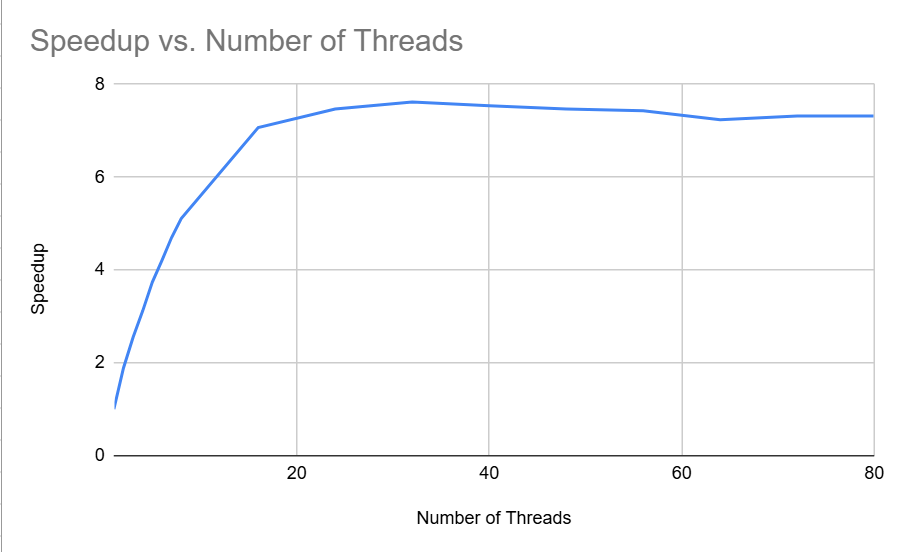

# Project-2 Report

## Output of runTrials.sh script.
|Thread Count|Wall Clock Time|User Time|System Time|Speedup|
|:--:|--:|--:|--:|:--:|
|1|14.56|13.90| 0.55|1.00|
|2| 7.69|14.20| 0.64| 1.89|
|3| 5.72|15.22| 0.80| 2.55|
|4| 4.67|15.98| 0.92| 3.12|
|5| 3.89|15.99| 1.05| 3.74|
|6| 3.46|16.60| 1.12| 4.21|
|7| 3.10|16.69| 1.29| 4.70|
|8| 2.85|16.90| 1.37| 5.11|
|16| 2.06|18.16| 3.38| 7.07|
|24| 1.95|19.07| 5.43| 7.47|
|32| 1.91|18.27|10.73| 7.62|
|40| 1.93|17.49|19.12| 7.54|
|48| 1.95|17.39|24.12| 7.47|
|56| 1.96|17.07|18.56| 7.43|
|64| 2.01|17.45|15.53| 7.24|
|72| 1.99|17.46|16.66| 7.32|
|80| 1.99|17.68|16.35| 7.32|

**Question: Notice that there is a maximum speed-up factor, but not necessarily using the most threads. Make a guess (i.e., write a short paragraph) as to why you think more threads aren’t necessary better. Here’s a hint: think about a group of people waiting to go through a turnstile (like at BART or Disney World). Are more people able to go through it just because there are more people?**

  Increasing the number of threads will improve performance initially, but only up to a certain point. When there are too many active threads, they compete for system resources. Using the example of a group of people waiting at a turnstile; No matter how many people are waiting, there is only one wait out of the line (assuming they want to complete their objective). These people will just end up waiting longer and longer.

## Timed.cpp
Results of run:  
main program 0.011422131s  
results output 4.16e-07s  
main program 2.842725272s  

Computing p:

$$ \frac{0.0114221 + 0.0000004}{2.8427252} = 0.00401 $$

$$ 1 - .004 = 0.996% $$

$$ speedup = \frac{1}{1 - 0.996 + \frac{0.996}{16}} = 1.99 $$

**Question: in reviewing the graph of speed-ups to number of threads, note that we get pretty linear (when you plot the dots, they’re pretty close to being a line) speed-up. What’s the slope of that line? (Pick two values, like for one and seven threads, and do the rise-over-run thing you learned in Algebra). Does that linear trend continue as we add more threads? What do you think causes the curve to “flatten out” when we use large thread counts?**

One thread -> 1.5, Seven Threads -> 5:
The change in the value is:

$$ 
\frac{5 - 1.5}{7 - 1} = \frac{3.5}{6} = 0.5833
$$

Ten Threads -> 6, Twenty Threads -> 7:
The change in the value is:

$$ 
\frac{7 - 6}{20 - 10} = \frac{1}{10} = 0.1
$$

Twenty-Five Threads -> 7.75, Thirty-Five Threads -> 7.75:
The change in the value is:

$$ 
\frac{7.75 - 7.75}{35 - 25} = \frac{0}{10} = 0
$$

The speedup does not continue, and the linear trend continues, signaling that we are no longer speeding up. We are seeing diminishing returns for parallelization. According to Amdahl's Law, the non-parallelizable portion of the program becomes more dominant as the number of threads increases. Also, for the same reasons mentioned in question #1. There is more overhead in managing additional threads.

